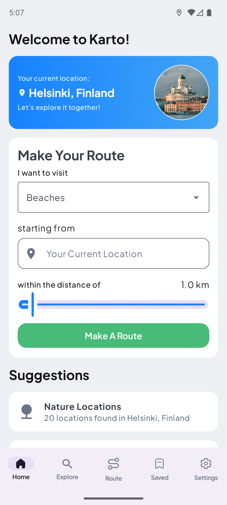

<h1 align="center">
   
  
   
  Markdownify
   
</h1>

<h4 align="center">A minimal Markdown Editor desktop app built on top of <a href="http://electron.atom.io" target="_blank">Electron</a>.</h4>

  
  
  
  

  <a href="#key-features">Key Features</a> •
  <a href="#how-to-use">How To Use</a> •
  <a href="#download">Download</a> •
  <a href="#credits">Credits</a> •
  <a href="#related">Related</a> •
  <a href="#license">License</a>

# Karto
Karto is a personal travel guide app designed for travelers exploring a location, whether near or abroad.

It helps users discover points of interest, plan routes, and explore efficiently based on travel time, distance, and category preferences.

Users can create, save, modify, and track routes, access reviews, mark visited locations, and get AI-powered descriptions for a richer travel experience.

## How to setup
1. Clone the git repository
2. Add a google maps API key into the .properties.template file. Remove .template from the file name.
3. Done, happy travelling!

